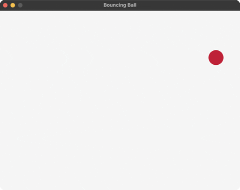
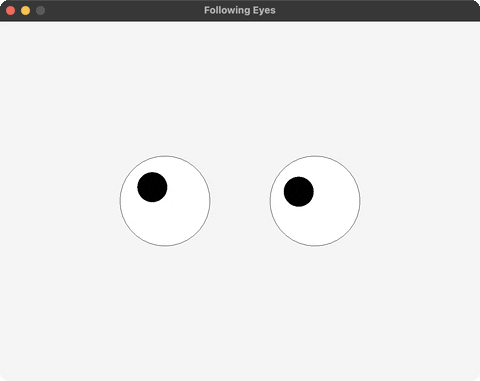
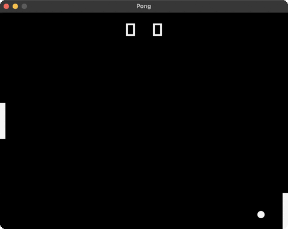
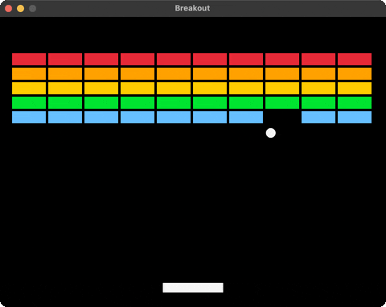
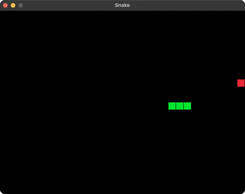
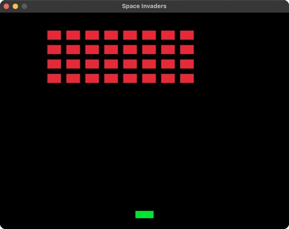
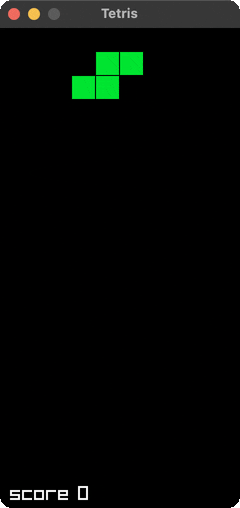
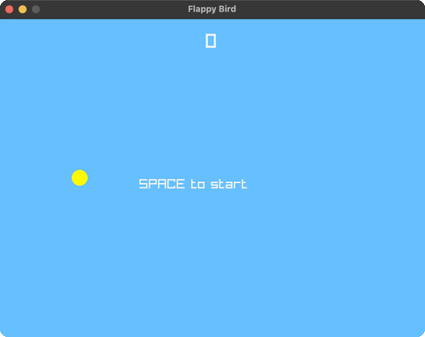

# Demo gallery

Every game the course has you build, running from this repo's own
[`exercises/`](../../exercises) code on its own vendored raylib engine.
Nothing here is borrowed from the sibling raylib suites: these are the
programs you end up with if you work through the lessons.

Every GIF is committed. Maintainers regenerate them with `bb record`,
which drives [screen-grab](https://github.com/burinc/b12n-screen-grab)
from [`scripts/demo_manifest.edn`](../../scripts/demo_manifest.edn) —
that file also holds the per-game capture settings and input timelines.

## 🎈 Phase 1 — Foundations

### Bouncing ball

The first thing that moves: one ball, one velocity vector, walls that
flip its sign. [Lesson](phase-1-foundations/04-polyglot-corner-bouncing-ball.md)

### Following eyes

Reading input every frame — two eyes that track the real mouse cursor.
[Lesson](phase-1-foundations/03-following-eyes.md)

## 🕹️ Phase 2 — Arcade Classics

### Lesson 1 — Pong

W/S move your paddle, the right one is a tracking AI.
[Lesson](phase-2-arcade-classics/01-pong.md)

### Lesson 2 — Breakout

A brick grid as data, cleared one collision at a time.
[Lesson](phase-2-arcade-classics/02-breakout.md)

> Short on purpose. Breakout's paddle reads a *held* key, which the
> capture tool cannot synthesise — it can only tap — so the recorded
> ball always gets past the paddle. The clip loops on the fall rather
> than sitting on a frozen board. Played by hand it rallies fine.

### Lesson 3 — Snake

The whole snake is a vector of cells; growing is a `conj`.
[Lesson](phase-2-arcade-classics/03-snake.md)

### Lesson 4 — Space Invaders

A marching enemy formation, one bullet in flight at a time.
[Lesson](phase-2-arcade-classics/04-space-invaders.md)

### Lesson 5 — Tetris

Pieces as offset vectors, rotation as a coordinate transform.
[Lesson](phase-2-arcade-classics/05-tetris.md)

### Lesson 6 — Flappy Bird

A title/playing/over state machine driven by a single key.
[Lesson](phase-2-arcade-classics/06-flappy-bird.md)

